# Class Diagram — AI-Powered Community Travel Explorer

## TypeScript OOP Class Diagram

```mermaid
classDiagram
    direction TB

    class User {
        -_id: ObjectId
        -name: string
        -email: string
        -password: string
        -avatar: string
        -role: UserRole
        -preferences: string[]
        -city: string
        -createdAt: Date
        -updatedAt: Date
        +register(data: RegisterDTO): Promise~User~
        +login(email: string, password: string): Promise~string~
        +updateProfile(data: UpdateProfileDTO): Promise~User~
        +resetPassword(email: string): Promise~void~
        +getPreferences(): string[]
        +setPreferences(prefs: string[]): void
    }

    class Place {
        -_id: ObjectId
        -name: string
        -description: string
        -location: GeoLocation
        -address: string
        -city: string
        -category: PlaceCategory
        -budgetRange: BudgetRange
        -operatingHours: string
        -suggestedDurationMinutes: number
        -tags: string[]
        -photos: string[]
        -averageRating: number
        -totalReviews: number
        -addedBy: ObjectId
        -isVerified: boolean
        +create(data: CreatePlaceDTO): Promise~Place~
        +update(data: UpdatePlaceDTO): Promise~Place~
        +delete(): Promise~void~
        +getByCity(city: string): Promise~Place[]~
        +search(query: SearchQuery): Promise~Place[]~
        +getNearby(lat: number, lng: number, radius: number): Promise~Place[]~
        +updateAverageRating(): Promise~void~
    }

    class Review {
        -_id: ObjectId
        -userId: ObjectId
        -placeId: ObjectId
        -rating: number
        -text: string
        -photos: string[]
        -helpfulVotes: number
        -visitDate: Date
        -createdAt: Date
        +create(data: CreateReviewDTO): Promise~Review~
        +update(data: UpdateReviewDTO): Promise~Review~
        +delete(): Promise~void~
        +getByPlace(placeId: ObjectId): Promise~Review[]~
        +voteHelpful(userId: ObjectId): Promise~void~
    }

    class Media {
        -_id: ObjectId
        -userId: ObjectId
        -placeId: ObjectId
        -type: MediaType
        -url: string
        -cloudinaryPublicId: string
        -caption: string
        -tags: string[]
        +upload(file: File, data: UploadMediaDTO): Promise~Media~
        +delete(): Promise~void~
        +getByPlace(placeId: ObjectId): Promise~Media[]~
    }

    class Reel {
        -_id: ObjectId
        -userId: ObjectId
        -placeId: ObjectId
        -videoUrl: string
        -cloudinaryPublicId: string
        -caption: string
        -thumbnailUrl: string
        -views: number
        -likes: number
        -saves: number
        +create(file: File, data: CreateReelDTO): Promise~Reel~
        +delete(): Promise~void~
        +incrementViews(): Promise~void~
        +toggleLike(userId: ObjectId): Promise~void~
        +getFeed(page: number): Promise~Reel[]~
    }

    class VisitEvent {
        -_id: ObjectId
        -placeId: ObjectId
        -creatorId: ObjectId
        -title: string
        -description: string
        -scheduledDate: Date
        -time: string
        -maxParticipants: number
        -visibility: EventVisibility
        -status: EventStatus
        +create(data: CreateEventDTO): Promise~VisitEvent~
        +update(data: UpdateEventDTO): Promise~VisitEvent~
        +cancel(): Promise~void~
        +getUpcoming(): Promise~VisitEvent[]~
        +getByPlace(placeId: ObjectId): Promise~VisitEvent[]~
    }

    class VisitRSVP {
        -_id: ObjectId
        -eventId: ObjectId
        -userId: ObjectId
        -status: RSVPStatus
        -respondedAt: Date
        +respond(status: RSVPStatus): Promise~VisitRSVP~
        +getByEvent(eventId: ObjectId): Promise~VisitRSVP[]~
    }

    class Thread {
        -_id: ObjectId
        -placeId: ObjectId
        -userId: ObjectId
        -content: string
        -mediaUrls: string[]
        -createdAt: Date
        +create(data: CreateThreadDTO): Promise~Thread~
        +delete(): Promise~void~
        +getByPlace(placeId: ObjectId): Promise~Thread[]~
    }

    class ThreadReply {
        -_id: ObjectId
        -threadId: ObjectId
        -userId: ObjectId
        -content: string
        -createdAt: Date
        +create(data: CreateReplyDTO): Promise~ThreadReply~
        +delete(): Promise~void~
        +getByThread(threadId: ObjectId): Promise~ThreadReply[]~
    }

    class RideComparison {
        -_id: ObjectId
        -userId: ObjectId
        -origin: GeoLocation
        -destination: GeoLocation
        -provider: RideProvider
        -estimatedFare: number
        -estimatedMinutes: number
        -distanceKm: number
        +compare(origin: GeoLocation, dest: GeoLocation): Promise~RideComparison[]~
        +getCheapest(): RideComparison
    }

    class AIRecommendation {
        -_id: ObjectId
        -userId: ObjectId
        -placeId: ObjectId
        -score: number
        -reason: string
        -type: RecommendationType
        +generate(userId: ObjectId): Promise~AIRecommendation[]~
        +getForUser(userId: ObjectId): Promise~AIRecommendation[]~
    }

    class Bookmark {
        -_id: ObjectId
        -userId: ObjectId
        -placeId: ObjectId
        -reelId: ObjectId
        -type: BookmarkType
        +toggle(data: ToggleBookmarkDTO): Promise~Bookmark~
        +getByUser(userId: ObjectId): Promise~Bookmark[]~
    }

    class FlagReport {
        -_id: ObjectId
        -reportedBy: ObjectId
        -targetType: FlagTargetType
        -targetId: ObjectId
        -reason: string
        -status: FlagStatus
        -resolvedBy: ObjectId
        +create(data: CreateFlagDTO): Promise~FlagReport~
        +resolve(adminId: ObjectId, action: string): Promise~void~
        +getPending(): Promise~FlagReport[]~
    }

    %% Service Classes
    class AuthService {
        +register(data: RegisterDTO): Promise~User~
        +login(email: string, password: string): Promise~AuthResponse~
        +verifyToken(token: string): Promise~TokenPayload~
        +resetPassword(email: string): Promise~void~
        -hashPassword(password: string): Promise~string~
        -generateToken(user: User): string
    }

    class PlaceService {
        +createPlace(data: CreatePlaceDTO): Promise~Place~
        +getPlaces(filters: PlaceFilters): Promise~Place[]~
        +getPlaceById(id: ObjectId): Promise~Place~
        +updatePlace(id: ObjectId, data: UpdatePlaceDTO): Promise~Place~
        +deletePlace(id: ObjectId): Promise~void~
        +searchPlaces(query: string): Promise~Place[]~
        +getNearbyPlaces(location: GeoLocation, radius: number): Promise~Place[]~
        -checkDuplicate(name: string, location: GeoLocation): Promise~boolean~
    }

    class MediaService {
        +uploadMedia(file: File, data: UploadMediaDTO): Promise~Media~
        +deleteMedia(id: ObjectId): Promise~void~
        +getMediaByPlace(placeId: ObjectId): Promise~Media[]~
        -uploadToCloudinary(file: File): Promise~CloudinaryResponse~
        -deleteFromCloudinary(publicId: string): Promise~void~
    }

    class AIService {
        +getRecommendations(userId: ObjectId): Promise~AIRecommendation[]~
        +checkDuplicate(placeName: string, location: GeoLocation): Promise~DuplicateResult~
        +moderateContent(content: string): Promise~ModerationResult~
        +generateItinerary(userId: ObjectId, city: string): Promise~Itinerary~
        -callAIEngine(prompt: string): Promise~AIResponse~
    }

    class NavigationService {
        +calculateDistance(origin: GeoLocation, dest: GeoLocation): Promise~DistanceResult~
        +getRoute(origin: GeoLocation, dest: GeoLocation): Promise~RouteResult~
        +estimateTravelTime(origin: GeoLocation, dest: GeoLocation, mode: TravelMode): Promise~TimeResult~
    }

    class RideService {
        +compareFares(origin: GeoLocation, dest: GeoLocation): Promise~RideComparison[]~
        +getCheapestOption(comparisons: RideComparison[]): RideComparison
        -fetchUberEstimate(origin: GeoLocation, dest: GeoLocation): Promise~FareEstimate~
        -fetchOlaEstimate(origin: GeoLocation, dest: GeoLocation): Promise~FareEstimate~
    }

    %% Enums
    class UserRole {
        <<enumeration>>
        GUEST
        USER
        ADMIN
    }

    class PlaceCategory {
        <<enumeration>>
        NATURE
        FOOD
        HERITAGE
        ADVENTURE
        SHOPPING
        NIGHTLIFE
        RELIGIOUS
        ENTERTAINMENT
    }

    class BudgetRange {
        <<enumeration>>
        FREE
        BUDGET
        MODERATE
        PREMIUM
    }

    class GeoLocation {
        <<interface>>
        +latitude: number
        +longitude: number
    }

    %% Relationships
    User "1" --> "*" Place : adds
    User "1" --> "*" Review : writes
    User "1" --> "*" Media : uploads
    User "1" --> "*" Reel : creates
    User "1" --> "*" VisitEvent : organizes
    User "1" --> "*" VisitRSVP : responds
    User "1" --> "*" Thread : posts
    User "1" --> "*" ThreadReply : replies
    User "1" --> "*" Bookmark : saves
    User "1" --> "*" FlagReport : reports

    Place "1" --> "*" Review : has
    Place "1" --> "*" Media : contains
    Place "1" --> "*" Reel : featured
    Place "1" --> "*" VisitEvent : hosts
    Place "1" --> "*" Thread : discussed

    VisitEvent "1" --> "*" VisitRSVP : has
    Thread "1" --> "*" ThreadReply : has

    AuthService ..> User : manages
    PlaceService ..> Place : manages
    PlaceService ..> AIService : uses
    MediaService ..> Media : manages
    AIService ..> AIRecommendation : generates
    NavigationService ..> GeoLocation : uses
    RideService ..> RideComparison : produces

    User --> UserRole : has
    Place --> PlaceCategory : categorized
    Place --> BudgetRange : has
    Place --> GeoLocation : located at
```

---

## Key Design Patterns

| Pattern | Usage |
|---|---|
| **Model Layer** | MongoDB Mongoose models (User, Place, Review, etc.) |
| **Service Layer** | Business logic encapsulated in service classes |
| **DTO Pattern** | Data Transfer Objects for input validation |
| **Repository Pattern** | Mongoose models act as repositories |
| **Dependency Injection** | Services injected into controllers |
| **Enum Types** | TypeScript enums for categorical values |
| **Interface Contracts** | Shared interfaces like GeoLocation |
