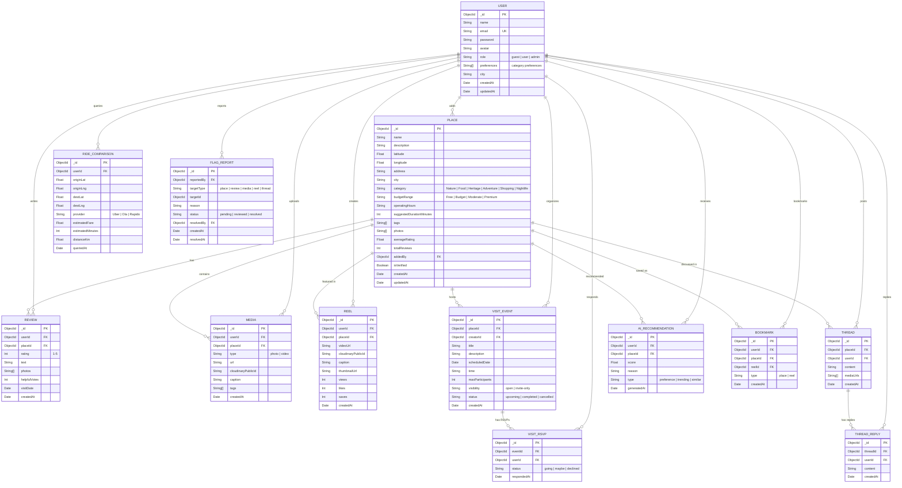

# ER Diagram — AI-Powered Community Travel Explorer

## Entity-Relationship Diagram

```mermaid
erDiagram
    USER {
        ObjectId _id PK
        String name
        String email UK
        String password
        String avatar
        String role "guest | user | admin"
        String[] preferences "category preferences"
        String city
        Date createdAt
        Date updatedAt
    }

    PLACE {
        ObjectId _id PK
        String name
        String description
        Float latitude
        Float longitude
        String address
        String city
        String category "Nature | Food | Heritage | Adventure | Shopping | Nightlife"
        String budgetRange "Free | Budget | Moderate | Premium"
        String operatingHours
        Int suggestedDurationMinutes
        String[] tags
        String[] photos
        Float averageRating
        Int totalReviews
        ObjectId addedBy FK
        Boolean isVerified
        Date createdAt
        Date updatedAt
    }

    REVIEW {
        ObjectId _id PK
        ObjectId userId FK
        ObjectId placeId FK
        Int rating "1-5"
        String text
        String[] photos
        Int helpfulVotes
        Date visitDate
        Date createdAt
    }

    MEDIA {
        ObjectId _id PK
        ObjectId userId FK
        ObjectId placeId FK
        String type "photo | video"
        String url
        String cloudinaryPublicId
        String caption
        String[] tags
        Date createdAt
    }

    REEL {
        ObjectId _id PK
        ObjectId userId FK
        ObjectId placeId FK
        String videoUrl
        String cloudinaryPublicId
        String caption
        String thumbnailUrl
        Int views
        Int likes
        Int saves
        Date createdAt
    }

    VISIT_EVENT {
        ObjectId _id PK
        ObjectId placeId FK
        ObjectId creatorId FK
        String title
        String description
        Date scheduledDate
        String time
        Int maxParticipants
        String visibility "open | invite-only"
        String status "upcoming | completed | cancelled"
        Date createdAt
    }

    VISIT_RSVP {
        ObjectId _id PK
        ObjectId eventId FK
        ObjectId userId FK
        String status "going | maybe | declined"
        Date respondedAt
    }

    THREAD {
        ObjectId _id PK
        ObjectId placeId FK
        ObjectId userId FK
        String content
        String[] mediaUrls
        Date createdAt
    }

    THREAD_REPLY {
        ObjectId _id PK
        ObjectId threadId FK
        ObjectId userId FK
        String content
        Date createdAt
    }

    RIDE_COMPARISON {
        ObjectId _id PK
        ObjectId userId FK
        Float originLat
        Float originLng
        Float destLat
        Float destLng
        String provider "Uber | Ola | Rapido"
        Float estimatedFare
        Int estimatedMinutes
        Float distanceKm
        Date queriedAt
    }

    AI_RECOMMENDATION {
        ObjectId _id PK
        ObjectId userId FK
        ObjectId placeId FK
        Float score
        String reason
        String type "preference | trending | similar"
        Date generatedAt
    }

    BOOKMARK {
        ObjectId _id PK
        ObjectId userId FK
        ObjectId placeId FK
        ObjectId reelId FK
        String type "place | reel"
        Date createdAt
    }

    FLAG_REPORT {
        ObjectId _id PK
        ObjectId reportedBy FK
        String targetType "place | review | media | reel | thread"
        ObjectId targetId
        String reason
        String status "pending | reviewed | resolved"
        ObjectId resolvedBy FK
        Date createdAt
        Date resolvedAt
    }

    %% Relationships
    USER ||--o{ PLACE : "adds"
    USER ||--o{ REVIEW : "writes"
    USER ||--o{ MEDIA : "uploads"
    USER ||--o{ REEL : "creates"
    USER ||--o{ VISIT_EVENT : "organizes"
    USER ||--o{ VISIT_RSVP : "responds"
    USER ||--o{ THREAD : "posts"
    USER ||--o{ THREAD_REPLY : "replies"
    USER ||--o{ RIDE_COMPARISON : "queries"
    USER ||--o{ AI_RECOMMENDATION : "receives"
    USER ||--o{ BOOKMARK : "bookmarks"
    USER ||--o{ FLAG_REPORT : "reports"

    PLACE ||--o{ REVIEW : "has"
    PLACE ||--o{ MEDIA : "contains"
    PLACE ||--o{ REEL : "featured in"
    PLACE ||--o{ VISIT_EVENT : "hosts"
    PLACE ||--o{ THREAD : "discussed in"
    PLACE ||--o{ AI_RECOMMENDATION : "recommended"
    PLACE ||--o{ BOOKMARK : "saved as"

    VISIT_EVENT ||--o{ VISIT_RSVP : "has RSVPs"

    THREAD ||--o{ THREAD_REPLY : "has replies"
```

