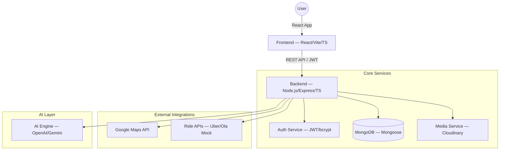

# AI-Powered Community Travel Explorer

## 1. Project Overview

The **AI-Powered Community Travel Explorer** is a full-stack web platform that enables travelers to discover, evaluate, plan, and experience places in unfamiliar cities through community contributions and intelligent automation. It combines social travel discovery, multimedia sharing, smart navigation, cost estimation, and collaborative trip planning into a single ecosystem.

**Tech Stack:** React (Frontend) · TypeScript with OOP · Node.js/Express (Backend) · MongoDB (Database)

---

## 2. Problem Statement

Travelers visiting new places face several recurring challenges:

| Problem | Description |
|---|---|
| **Fragmented Information** | Travel details are scattered across multiple apps and websites |
| **Lack of Authentic Experiences** | Curated content doesn't reflect real visitor perspectives |
| **Uncertain Travel Costs** | Ride fares and expenses are unpredictable across providers |
| **Hidden Gems Undiscoverable** | Lesser-known but valuable locations remain untouched |
| **No Group Planning Tools** | Coordinating group travel involves fragmented communication |

Existing tools solve isolated problems but fail to provide an **integrated, social, AI-driven travel workflow**.

---

## 3. Proposed Solution

A unified AI-assisted travel environment where users can:

- **Discover** community-listed places (cafes, attractions, hidden gems)
- **Upload & Explore** real experiences with photos, videos, and reviews
- **View Structured Details** (GPS, budget, hours, visit duration, tags)
- **Compare Travel Costs** across ride providers
- **Watch Short Travel Reels** for quick place discovery
- **Schedule & Join Group Visits** with other travelers
- **Receive AI-Powered Guidance** for recommendations, itineraries, and moderation

AI acts as an intelligence layer enhancing recommendations, content moderation, and planning.

---

## 4. Key Features

### 4.1 Community Place Discovery
- Users upload new places with structured metadata
- AI-powered duplicate detection prevents redundant entries
- Experience-based updates enrich existing place profiles

### 4.2 Experience & Media Sharing
- Text reviews with star ratings
- Photo and video uploads (via Cloudinary)
- Visit tips and contextual tags
- Chronological timeline of visitor experiences

### 4.3 Standardized Place Information
Every place includes:
-  GPS coordinates (latitude, longitude)
-  Price/budget range (Free, Budget, Moderate, Premium)
-  Operating hours
-  Suggested visit duration
-  Category tags (Nature, Food, Heritage, Adventure, etc.)

### 4.4 AI Recommendation Engine
- Personalized place suggestions based on user preferences
- Budget-aware exploration recommendations
- Smart itinerary hints and contextual travel insights
- Similarity-based discovery ("Users who liked X also liked Y")

### 4.5 Ride Fare Estimation & Comparison
- Estimated cost comparison across ride providers (Uber, Ola, etc.)
- Travel time estimation for each provider
- Cheapest option highlighting

### 4.6 Short Travel Reels
- Swipe-based TikTok/Instagram-style video discovery
- Location-tagged short clips
- Save and revisit places from reels

### 4.7 Collaborative Visit Scheduling
- Plan visits to specific locations
- Open or invite-only group participation
- Calendar-based scheduling with notifications

### 4.8 Smart Navigation Assistance
- Distance calculation from current location
- Route suggestions via Google Maps integration
- Estimated travel duration for walk, drive, transit

### 4.9 Community Threads per Place
- Discussion feed for each place
- Media timeline showing all uploads
- Visitor tips, warnings, and live updates

### 4.10 AI Moderation & Enhancement
- Duplicate place detection before submission
- Media and content quality filtering
- Quality-based ranking of contributions

---

## 5. System Architecture

---

## 6. Tech Stack

| Layer | Technology |
|---|---|
| **Frontend** | React, TypeScript, Vite, React Router, Axios |
| **Styling** | CSS / Material UI |
| **Backend** | Node.js, Express.js, TypeScript |
| **Database** | MongoDB with Mongoose ODM |
| **Auth** | JWT + bcrypt |
| **Media Storage** | Cloudinary |
| **Maps** | Google Maps JavaScript API |
| **AI** | OpenAI / Google Gemini API |
| **Ride Estimation** | Mock API / Uber/Ola API |

---

## 7. User Roles

| Role | Permissions |
|---|---|
| **Guest** | Browse places, view reels, view reviews |
| **Registered User** | Upload places, write reviews, upload media, schedule visits, join groups |
| **Admin** | Manage users, moderate content, view analytics, manage flagged content |

---

## 8. Modules

| Module | Description |
|---|---|
| Authentication | Register, Login, JWT-based session, password reset |
| Place Management | CRUD for places, duplicate detection, category tagging |
| Review & Rating | Star ratings, text reviews, helpful votes |
| Media Upload | Photo/video upload, Cloudinary integration, galleries |
| Reels | Short video feed, swipe navigation, location tagging |
| Ride Comparison | Fare estimation, multi-provider comparison, route display |
| Visit Scheduling | Event creation, RSVP, calendar integration |
| AI Recommendations | Personalized suggestions, itinerary generation |
| Navigation | Distance calc, route display, travel time estimation |
| Community Threads | Discussion feed, replies, media timeline |
| Admin Dashboard | User management, content moderation, analytics |

---

## 9. Non-Functional Requirements

- **Scalability** — Horizontal scaling with MongoDB sharding
- **Security** — JWT auth, input validation, rate limiting, XSS/CSRF protection
- **Performance** — Image optimization, lazy loading, API caching
- **Responsiveness** — Mobile-first design, works on all screen sizes
- **Accessibility** — WCAG 2.1 compliance where possible

---

## 10. Future Enhancements

-  AI-powered full trip planner
-  Crowd and weather prediction integration
-  Gamified contributor rewards (badges, leaderboard)
-  Offline exploration mode with cached data
-  Smart alerts (trending places, flash deals, group invites)
-  Multi-language support
-  Contributor analytics dashboard

---

## 11. Expected Impact

| Impact Area | Outcome |
|---|---|
| **Decision Making** | Faster, data-driven travel choices |
| **Discovery** | Community-powered hidden gem surfacing |
| **Cost Transparency** | Real-time fare comparison reduces overspending |
| **Social Exploration** | Group planning encourages collaborative travel |
| **Content Quality** | AI moderation ensures reliable information |

---

## 12. Goal

To build a **scalable, AI-enhanced platform** that transforms how people discover, plan, and experience travel — combining social collaboration, multimedia exploration, and intelligent decision support into a single, unified ecosystem.
