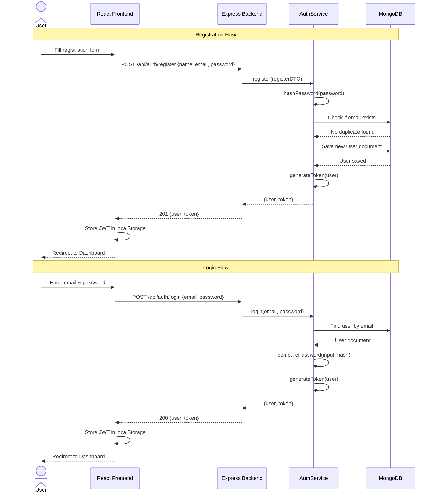
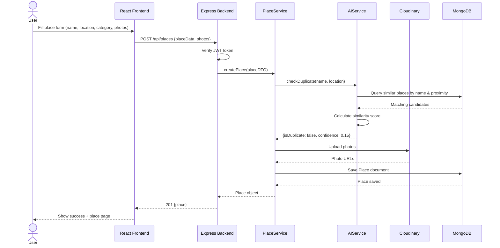
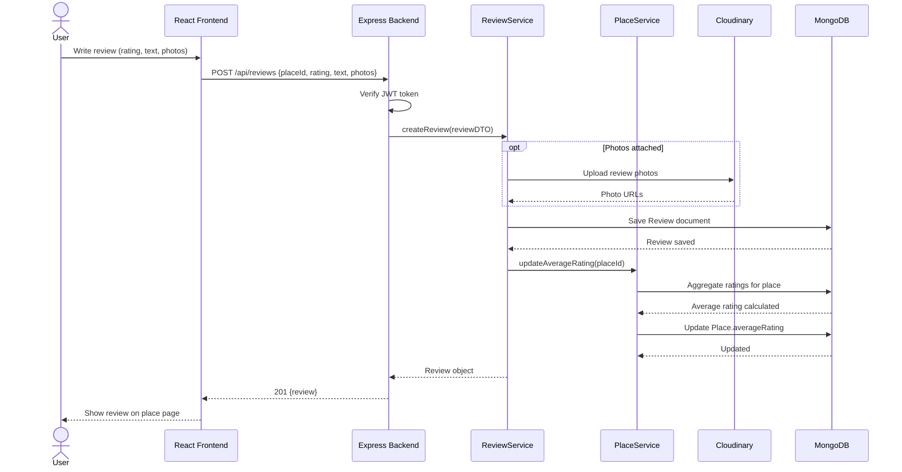
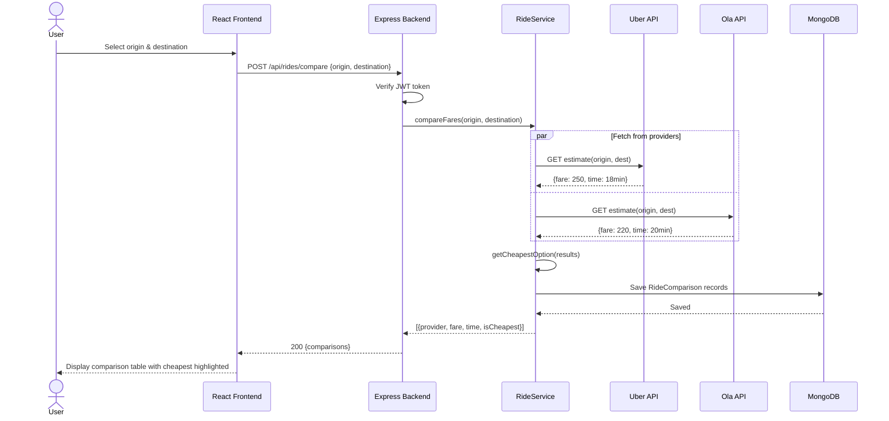
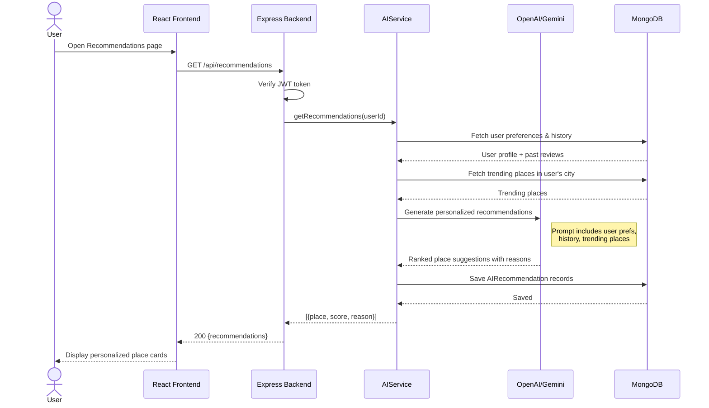
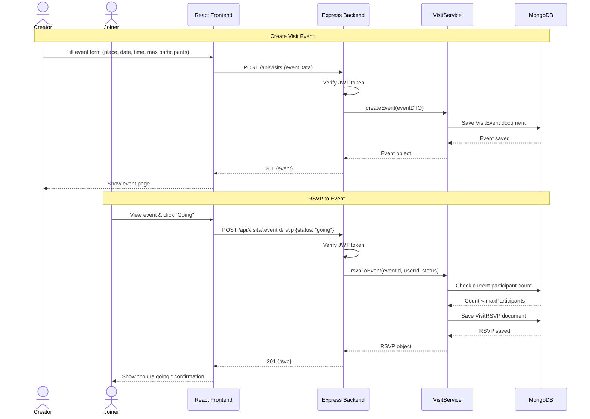
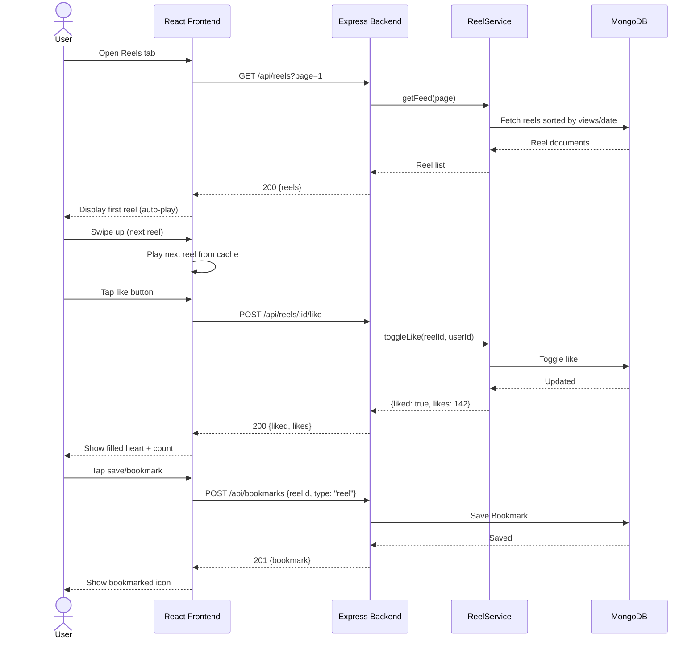
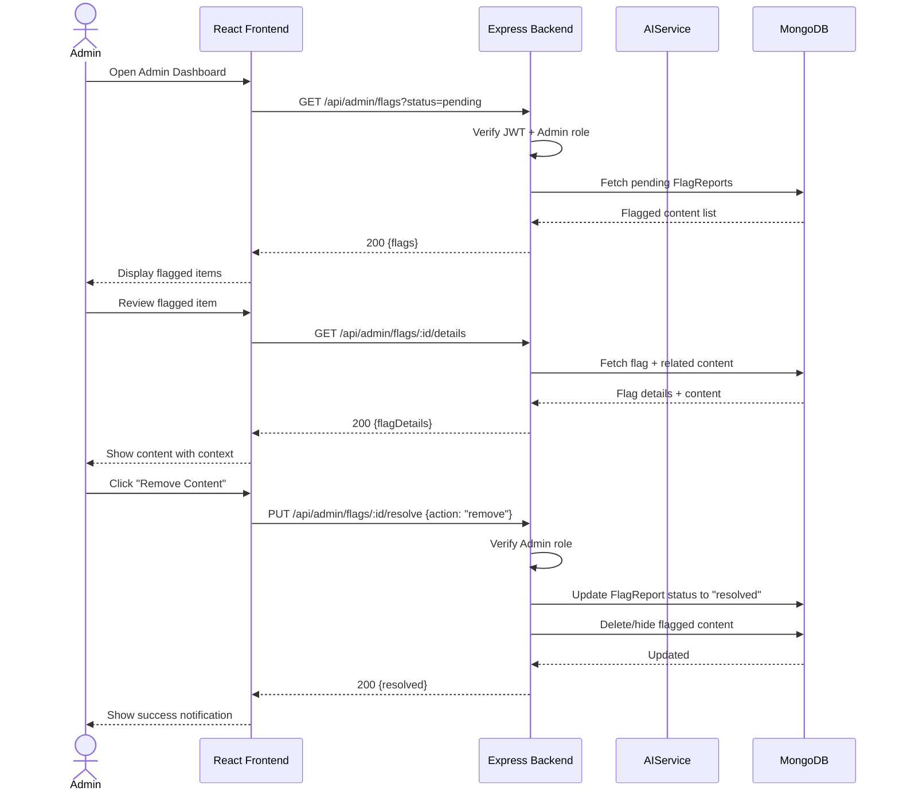

# Sequence Diagrams — AI-Powered Community Travel Explorer

## 1. User Registration & Login

---

## 2. Upload New Place (with AI Duplicate Detection)

---

## 3. Write Review & Update Rating

---

## 4. Compare Ride Fares

---

## 5. Get AI Recommendations

---

## 6. Schedule & RSVP to Group Visit

---

## 7. Watch & Interact with Reels

---

## 8. Admin Content Moderation

