# Use Case Diagram — AI-Powered Community Travel Explorer

## Actors

| Actor | Description |
|---|---|
| **Guest** | Unauthenticated visitor browsing the platform |
| **Registered User** | Authenticated user with full platform access |
| **Admin** | Platform administrator with moderation & management capabilities |
| **AI Engine** | External AI service (OpenAI/Gemini) for recommendations & moderation |
| **Maps API** | Google Maps for navigation & distance calculations |
| **Ride API** | Uber/Ola APIs for fare estimation |
| **Cloudinary** | Media storage & processing service |

---

## Use Case Diagram

```mermaid
graph LR
    subgraph Actors
        Guest((Guest))
        User((Registered User))
        Admin((Admin))
    end

    subgraph "External Systems"
        AI["AI Engine"]
        Maps["Maps API"]
        Rides["Ride API"]
        Cloud["Cloudinary"]
    end

    subgraph "Authentication Module"
        UC1["Register Account"]
        UC2["Login"]
        UC3["Reset Password"]
        UC4["Manage Profile"]
    end

    subgraph "Place Discovery Module"
        UC5["Browse Places"]
        UC6["Search Places"]
        UC7["View Place Details"]
        UC8["Upload New Place"]
        UC9["Edit Place Info"]
        UC10["Detect Duplicates"]
    end

    subgraph "Experience & Media Module"
        UC11["Write Review"]
        UC12["Rate Place"]
        UC13["Upload Photos/Videos"]
        UC14["View Media Gallery"]
        UC15["View Experience Timeline"]
    end

    subgraph "Reels Module"
        UC16["Watch Reels"]
        UC17["Upload Reel"]
        UC18["Save Reel to Bookmarks"]
    end

    subgraph "Navigation & Ride Module"
        UC19["Calculate Distance"]
        UC20["View Route Suggestions"]
        UC21["Compare Ride Fares"]
        UC22["Estimate Travel Time"]
    end

    subgraph "Visit Scheduling Module"
        UC23["Create Visit Event"]
        UC24["RSVP to Visit"]
        UC25["View Upcoming Visits"]
    end

    subgraph "Community Module"
        UC26["Post in Thread"]
        UC27["Reply to Thread"]
        UC28["Share Visit Tips"]
    end

    subgraph "AI Features Module"
        UC29["Get AI Recommendations"]
        UC30["AI Content Moderation"]
        UC31["Generate Itinerary Hints"]
    end

    subgraph "Admin Module"
        UC32["Manage Users"]
        UC33["Moderate Content"]
        UC34["View Analytics"]
        UC35["Handle Flagged Content"]
    end

    %% Guest connections
    Guest --> UC5
    Guest --> UC6
    Guest --> UC7
    Guest --> UC14
    Guest --> UC16
    Guest --> UC1

    %% User connections
    User --> UC2
    User --> UC3
    User --> UC4
    User --> UC5
    User --> UC6
    User --> UC7
    User --> UC8
    User --> UC9
    User --> UC11
    User --> UC12
    User --> UC13
    User --> UC14
    User --> UC15
    User --> UC16
    User --> UC17
    User --> UC18
    User --> UC19
    User --> UC20
    User --> UC21
    User --> UC22
    User --> UC23
    User --> UC24
    User --> UC25
    User --> UC26
    User --> UC27
    User --> UC28
    User --> UC29
    User --> UC31

    %% Admin connections
    Admin --> UC32
    Admin --> UC33
    Admin --> UC34
    Admin --> UC35

    %% External system connections
    UC10 --> AI
    UC29 --> AI
    UC30 --> AI
    UC31 --> AI
    UC13 --> Cloud
    UC17 --> Cloud
    UC19 --> Maps
    UC20 --> Maps
    UC22 --> Maps
    UC21 --> Rides
```

---

## Use Case Descriptions

### UC1 — Register Account
| Field | Detail |
|---|---|
| **Actor** | Guest |
| **Description** | Guest creates a new account with email, password, and profile details |
| **Precondition** | Guest is not logged in |
| **Postcondition** | New user account created, JWT token issued |

### UC5 — Browse Places
| Field | Detail |
|---|---|
| **Actor** | Guest, Registered User |
| **Description** | View a list of places filtered by city, category, or budget |
| **Precondition** | None |
| **Postcondition** | List of matching places displayed |

### UC8 — Upload New Place
| Field | Detail |
|---|---|
| **Actor** | Registered User |
| **Description** | User submits a new place with name, GPS, category, hours, budget |
| **Precondition** | User is authenticated |
| **Postcondition** | Place saved; AI checks for duplicates |
| **Includes** | UC10 (Detect Duplicates) |

### UC11 — Write Review
| Field | Detail |
|---|---|
| **Actor** | Registered User |
| **Description** | User writes a text review for a place they visited |
| **Precondition** | User is authenticated, place exists |
| **Postcondition** | Review saved and visible on place page |

### UC21 — Compare Ride Fares
| Field | Detail |
|---|---|
| **Actor** | Registered User |
| **Description** | Compare estimated ride costs from multiple providers |
| **Precondition** | User has selected origin and destination |
| **Postcondition** | Fare estimates displayed with cheapest option highlighted |

### UC23 — Create Visit Event
| Field | Detail |
|---|---|
| **Actor** | Registered User |
| **Description** | Schedule a group visit to a location |
| **Precondition** | User is authenticated, place exists |
| **Postcondition** | Event created, visible to community |

### UC29 — Get AI Recommendations
| Field | Detail |
|---|---|
| **Actor** | Registered User |
| **Description** | AI suggests places based on user preferences and history |
| **Precondition** | User is authenticated |
| **Postcondition** | Personalized list of recommendations displayed |

### UC33 — Moderate Content
| Field | Detail |
|---|---|
| **Actor** | Admin |
| **Description** | Admin reviews and takes action on flagged content |
| **Precondition** | Admin is authenticated |
| **Postcondition** | Content approved, edited, or removed |
